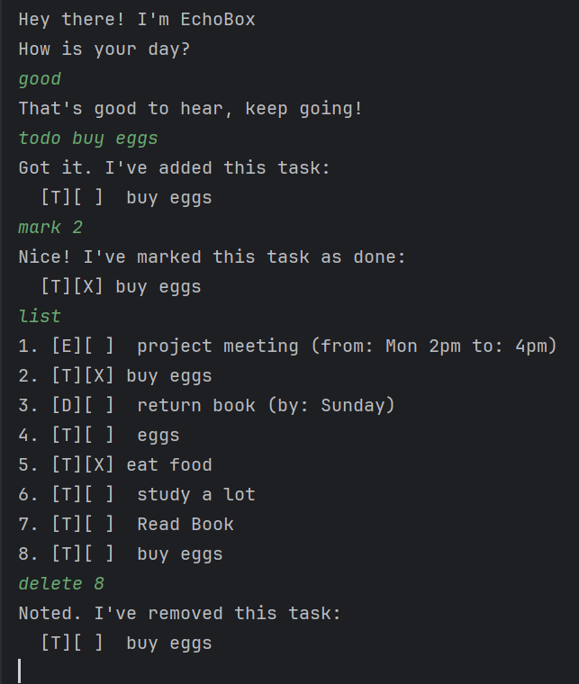
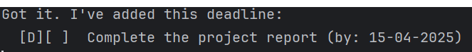
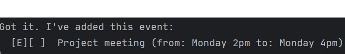
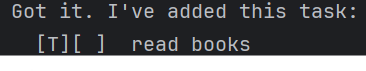
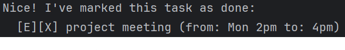
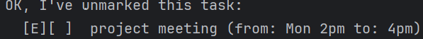
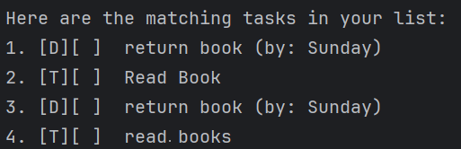
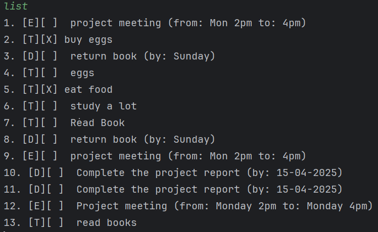
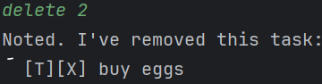

# **EchoBox User Guide**

## **Product introduction** 

EchoBox is a simple, user-friendly chatbot designed to help you organize your tasks, keep track of your to-dos, deadlines, and events in a categorized manner, and even brighten your day! With intuitive commands, EchoBox allows you to manage your tasks efficiently and interact in a fun way. Whether you need to add a new task, mark it as done, or simply get a motivational response when feeling down, EchoBox is here to make task management easier and more enjoyable.

## **Table of contents** 

<ins>Features:</ins> 
//italicise from 1 to 6
_1. Add Deadlines_ 
_2. Add Events_ 
_3. Add ToDos_
_4. Mark tasks as done_ 
_5. Mark tasks as undone_ 
_4. Find tasks_
_5. List the available tasks_ 
_6. Delete unwanted tasks_

### **Add deadlines** 
Add a task with a due date using deadline _<description> /by <due date>._

#### Command: deadline Complete the project report /by 15-04-2025
#### Outcome: 

### **Add Events** 
Add an event using event _<description> /from <start> /to <end>._

#### Command: event Project meeting /from Monday 2pm /to Monday 4pm
#### Outcome: 

### **Add ToDos** 
Add a task with todo _<description>_

#### Command: todo read books 
#### Outcome:

### **Mark tasks as done** 
Mark a finished task as done with mark _<task number>_.

#### Command: mark 1
#### Outcome:

### **Mark tasks as not done** 
Mark uncompleted task as not done with mark _<task number>._

#### Command: unmark 1
#### Outcome:

### **Find task**   
Search tasks by keyword using find _<keyword>._

#### Command: Find book
#### Outcome: 

### **List tasks**   
View all tasks with _<list>_

#### Command: list
#### Outcome:

### **Delete tasks**   
Delete an unwanted task using delete _<task number>._

#### Command: delete 2
#### Outcome:

## **End**
That's all you need to get started with EchoBox! 
With simple commands come powerful Organization!

